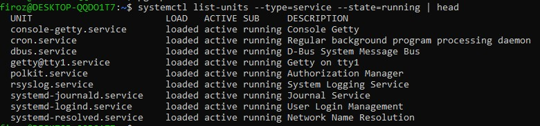
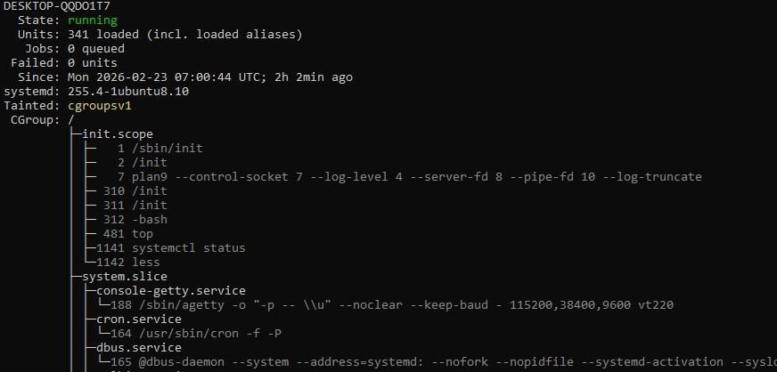
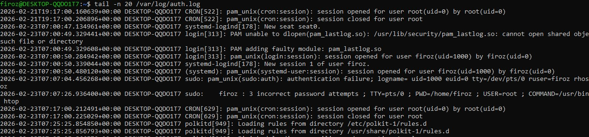

# Linux Practice – Process, Service & Log Commands

##  Process commands
### 1. `ps -aux | head -n 10`
- List running processes(top 10 lines).

### 2. `ps aux | grep sshd`
 - Get the process id by process name.
Explanation:
Shows detailed resource usage and ownership of SSH daemon and session processes.

Observations from output:

SSH daemon runs as root
User sessions run as ubuntu
Multiple sessions create multiple sshd processes (normal behavior)
📸 Output:

### 3. `pgrep -a sshd`

* What it does

pgrep → Finds process IDs (PID) by process name.

sshd → The SSH daemon process (SSH server).

-a → Shows full command line along with PID.

👉 So this command lists all running SSH daemon processes with their PID + full command.

📸 Output:

## Service Commands

### 1. `systemctl list-units --type=service --state=running`

**Explanation:**  
Lists all currently running system services, confirming overall system health.

**Observations from output:**
- `ssh.service` is running
- Core services (`cron`, `systemd-journald`, `networkd`) are active
- Instance is stable

📸 Output:

### 2. `systemctl status ssh`

**Explanation:**  
Displays the health, uptime, and recent activity of the SSH service managed by systemd.

**Observations from output:**
- SSH is active (running)
- Listening on port 22
- EC2 Instance Connect is providing SSH keys
- Successful public key authentication

📸 Output:
 ec2

### 3. `systemctl status`

systemctl status | head -n 20 - Prints first 20 lines of system service status summary.
📸 Output:

## Log Commands
### 1 `journalctl -u ssh -n 20` 
journalctl → View system logs managed by systemd journal

-u ssh → Show logs for the SSH service (ssh / sshd unit)

-n 20 → Display the last 20 log entries

### 2 `tail -n 20 /var/log/auth.log`
tail → Displays the last lines of a file

-n 20 → Show the last 20 lines

/var/log/auth.log → Authentication log file (SSH, sudo, login events)

👉 This command shows the latest 20 authentication events.
📸 Output:

