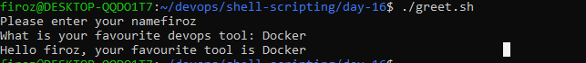

## Task 1: First Script
1. Create a file `hello.sh`
2. Add the shebang line `#!/bin/bash` at the top
3. Print `Hello, DevOps!` using `echo`
4. Make it executable and run it

[Script](scripts/hello.sh)

* What happens if you remove the shebang line?
 - The script runs after removing shebang line :
    - `./hello.sh` - The kernel checks for a shebang to identify the interpreter.If no shebang is found, the script is executed using the current shell.
    - `bash hello.sh` - The script is explicitly executed by the Bash shell,independent of the presence of a shebang.
    - `sh hello.sh` - The script is executed using the `sh shell`,which may differ in behavior from bash

## Task 2: Variables
1. Create variables.sh with:
A variable for your NAME
A variable for your ROLE (e.g., "DevOps Engineer")
Print: Hello, I am <NAME> and I am a <ROLE>

[Script](scripts/variables.sh)

Try using single quotes vs double quotes — what's the difference?

Definition:

➡️ Single quotes preserve the exact value of each character inside the quotes.

➡️ Double quotes preserve text but still allow shell to interpret variables and commands inside.
## Task 3: User Input with read
Create greet.sh that:
Asks the user for their name using read
Asks for their favourite tool
Prints: Hello <name>, your favourite tool is <tool>

[Script](scripts/greet.sh)

