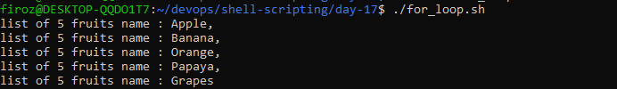

# Day 17 – Shell Scripting: Loops, Arguments & Error Handling

## Task 1: For Loop
1. Create `for_loop.sh` that:
   - Loops through a list of 5 fruits and prints each one
   
   [Script](scripts/for_loop.sh)
   
   
