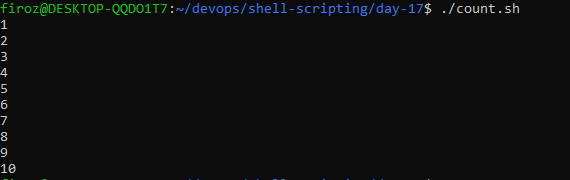
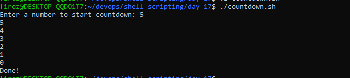

# Day 17 – Shell Scripting: Loops, Arguments & Error Handling

## Task 1: For Loop
1. Create `for_loop.sh` that:
   - Loops through a list of 5 fruits and prints each one
   
   [Script](scripts/for_loop.sh)
   
   
2. Create `count.sh` that:
   - Prints numbers 1 to 10 using a for loop
   
   [Script](scripts/count.sh)
   
   
   
---   

## Task 2: While Loop
1. Create `countdown.sh` that:
   - Takes a number from the user
   - Counts down to 0 using a while loop
   - Prints "Done!" at the end

   [Script](scripts/countdown.sh)
  
   

---

   
