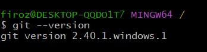

# Day 22 – Introduction to Git: Your First Repository

## Task 1: Install and Configure Git
1. Verify Git is installed on your machine
2. Set up your Git identity — name and email
3. Verify your configuration

   
   
---

# Git Basics -- Simple Interview Answers

## 1. What is the difference between `git add` and `git commit`?

-   **git add** → moves changes from the **working directory to the
    staging area**.
-   **git commit** → saves the staged changes permanently in the **Git
    repository**.

Example flow:

    edit file → git add file → git commit -m "message"

------------------------------------------------------------------------

## 2. What does the staging area do? Why doesn't Git just commit directly?

The **staging area** lets you **select which changes should go into the
next commit**.

Reason: - You may change many files. - You might want to **commit only
some changes**.

Flow:

    Working Directory → Staging Area → Repository

------------------------------------------------------------------------

## 3. What information does `git log` show you?

`git log` shows the **commit history**, including: - Commit ID (hash) -
Author name - Date of commit - Commit message

------------------------------------------------------------------------

## 4. What is the `.git/` folder and what happens if you delete it?

The **`.git/` folder** stores: - commit history - branches -
configuration - repository data

If you **delete `.git/`**, the project **stops being a Git repository**
and all version history is lost.

------------------------------------------------------------------------

## 5. What is the difference between working directory, staging area, and repository?

  Area                Meaning
  ------------------- ---------------------------------------------------
  Working Directory   Files you are currently editing
  Staging Area        Temporary area where you prepare files for commit
  Repository          Permanent Git history of commits

Flow:

    Working Directory → Staging Area → Repository
